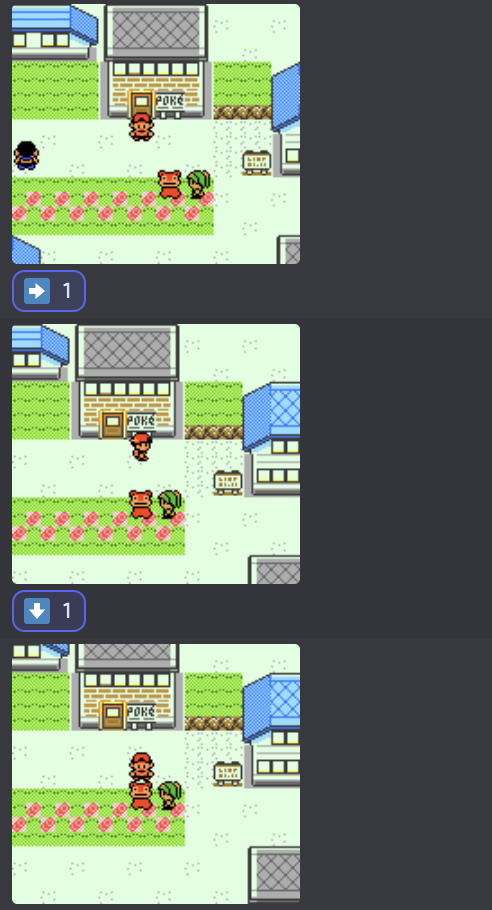

# pokemon-discord

```
Note: このDiscordアプリは現在作成途中です。
```

Discord上でポケモンをプレイしよう！



## Features

- スタンプでポケモンをプレイ可能

**TODOs**

- モノクロゲームボーイの場合、画面を緑っぽくする
- 画面サイズを2倍に
- 最新の画面に対するスタンプのみを有効に
- `/stats`,`/townmap`コマンドの実装
- コードをもうちょっと綺麗に

## Usage

`.env`ファイルを作成して次のように必要な情報を入力してください。

```sh
TOKEN = DISCORD_ACCESS_TOKEN
CLIENT_ID = DISCORD_APP_ID
GUILD_ID = DISCORD_GUILD_ID
CHANNEL_ID = DISCORD_CHANNEL_ID
OMEGA_PATH = game/omega # Windowsの場合は game/omega.exe
ROM_PATH = game/pokecrystal.gbc
```

```sh
$ yarn dev
```
